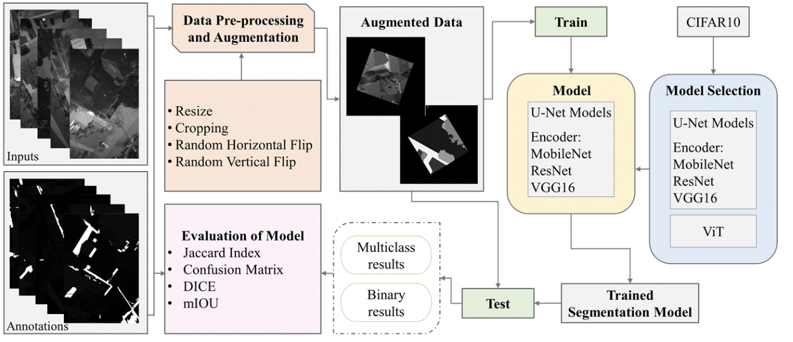

# IDS705_Final_Team2

## Purpose:

This repo contains models and analysis tools for semantic segmentation of aerial drone images. 

The ethics and safety of UAVs have been called into question for some time, but with so much environmental and social upside, developing safe flying and landing is of the utmost importance. In order to enhance drone safety, our research is concerned with applying state of the art deep learning models to solve semantic segmentation of drone cameras. To evaluate the performance of our models we used several metrics common in semantic segmentation problems including the jaccard index and dice score and confusion matrices. This repo contains the models as well as tools developed for easy analysis of the models performance. 

## Scripts and uses:

The [preprocess.py](10_code/preprocess.py) script contains a torch dataset subclass that performs the appropriate data augmentations. takes in 2 inputs, image directory and annotation directory.

There are several well-known deep learning models for image classification, including Vgg-16, ResNet18, and MobileNet_v3.

1. Vgg-16 was first published by Karen Simonyan and Andrew Zisserman from the University of Oxford, and its original paper can be found at https://arxiv.org/abs/1409.1556v6. It is a deep convolutional neural network with 16 layers that achieved state-of-the-art performance on the ImageNet dataset at the time of its release.

2. ResNet18 is another popular image classification model published by Microsoft Research Asia, with its original paper available at https://arxiv.org/abs/1512.03385. It introduced the concept of residual connections, which allowed for the creation of much deeper neural networks that were easier to train and had higher accuracy.

3. MobileNet_v3 was published by Google and is designed for efficient image classification on mobile and embedded devices. Its original paper can be found at https://arxiv.org/abs/1905.02244. MobileNet_v3 uses a combination of depthwise separable convolutions, linear bottlenecks, and other techniques to achieve high accuracy while maintaining a low computational footprint.

*Load the model* with 

`model = torch.load("your-local-path/moblenetv3/Unet-Mobilenet_large100.pt")`

If the environment lacks of GPU, please add `map_location=torch.device("cpu")`\
If the environment chip is M1, please add `map_location=torch.device("mps")`

If you want to *reproduce the models*, please refer to those codes (jupyter notebook):
1. [vgg-16](30_results/Models/Unet-vgg16_22.pt)
2. [ResNet18](30_results/Models/Unet-resnet18_2.pt)
3. [MobileNetv2](30_results/Models/Unet-Mobilenet_v2_mIoU-0.437.pt)
4. [MobileNetv3_large_100](30_results/Models/Unet-Mobilenet_large100.pt)

Examine the established outputs:
[This zip contains the output masks for MobileNet_large100 in .pt format](30_results/MobileNet_v3_data/masked_list_MobileNet_v3.pt.zip)

The [metrics.py](10_code/metrics.py) script computes all the metrics using the predictions and ground truth. This requires two .pt files which are lists of mask tensors.
